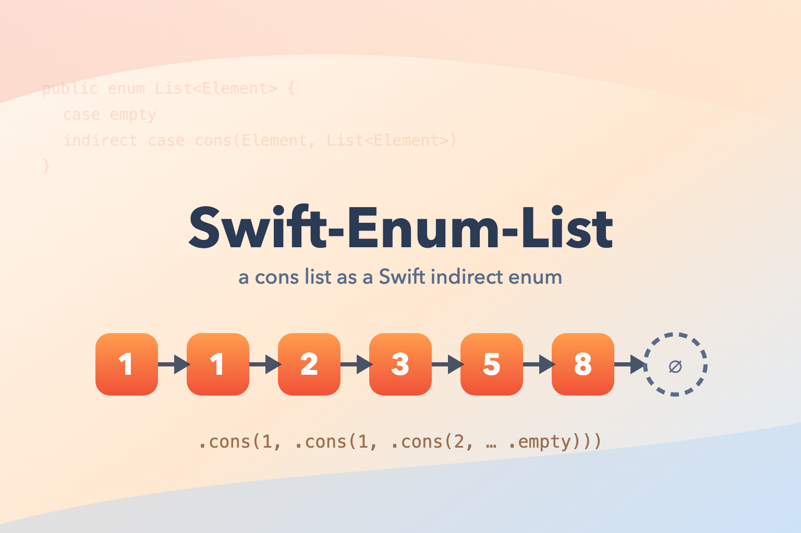

# Swift-Enum-List

   



A functional, immutable **linked list (cons list)** implemented as a Swift `indirect enum` — a small educational framework showing how a classic Lisp-style list maps onto Swift's type system.

```swift
public enum List<Element> {
    case empty
    indirect case cons(Element, List<Element>)
}
```

## About

This is a 2019 sample project exploring recursive enums and `Collection` conformance in Swift. It is not intended for production use, but as a compact reference for:

- `indirect enum` for recursive data structures
- Conforming a custom type to `Collection`, `Equatable`, and `CustomStringConvertible`
- Recursive implementations of `map`, `flatMap`, `reversed`, and concatenation

## Features

- Variadic and `Collection`-based initializers: `List(1, 1, 2, 3, 5, 8)` / `List(from: [1, 2, 3])`
- `Collection` conformance — `count`, `first`, iteration, `zip`, etc. work out of the box
- Recursive `map` / `flatMap` returning a new `List`
- `dropFirst(_:)`, `reversed()`, and a `+` operator for concatenation
- Subscripts: `list[i]` (preconditioned), `list[safe: i]` (optional), `list[from: i]` (suffix)
- `Equatable` when `Element: Equatable`, and a comma-separated `description`

## Usage

```swift
let fib = List(1, 1, 2, 3, 5, 8)

fib.count                    // 6
fib[0]                       // 1
fib[safe: 100]               // nil
fib.map { $0 * $0 }          // List(1, 1, 4, 9, 25, 64)
fib.dropFirst(2).first       // 2
List(0) + fib + List(13)     // List(0, 1, 1, 2, 3, 5, 8, 13)
"\(fib)"                     // "1, 1, 2, 3, 5, 8"
```

## Requirements

- Xcode with Swift 5.0 or later
- macOS 10.15+ (built as a macOS framework target)

## Getting Started

```sh
git clone https://github.com/GeneralD/Swift-Enum-List.git
open Swift-Enum-List/List.xcodeproj
```

Build the `List` framework target, or run the test suite (`⌘U`) — `ListTests` doubles as a usage spec, including performance baselines.
